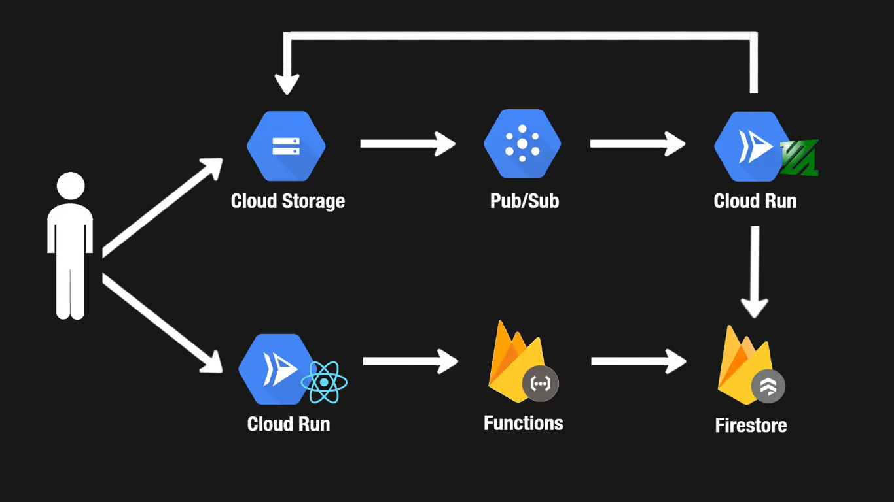

# YouTube Clone – Simplified Video Sharing App

This is a simplified YouTube clone built as part of a Full Stack Development (Neetcode.io). The project focuses on implementing the core functionality of YouTube—uploading and watching videos—using modern cloud-native tools.

> **Note**: This project is a learning exercise and is **not intended for production use**. It is not publicly deployed to avoid misuse (e.g., uploading illegal content).

---

## Project Goals

- **Not** a full-featured YouTube clone
- Focused on core functionality: user sign-in, video upload, processing, and viewing
- Keep the system simple while exploring real-world architecture patterns
- Learn about scalability tradeoffs, cloud services, and asynchronous processing

---

## Features

- Google Sign-In with Firebase Auth  
- Authenticated users can upload videos  
- Videos are transcoded into multiple resolutions (360p, 720p) using FFmpeg  
- Raw and processed videos are stored in Google Cloud Storage  
- Background video processing with Cloud Run and Cloud Pub/Sub  
- Video metadata is stored in Firestore  
- Public viewing of uploaded videos  
- Built with Next.js frontend (React)

---

## Tech Stack

| Layer                  | Tool                          |
|------------------------|-------------------------------|
| Frontend               | Next.js (React)               |
| Authentication         | Firebase Auth                 |
| API / Backend Logic    | Firebase Functions            |
| Background Processing  | Cloud Run                     |
| Messaging / Queue      | Cloud Pub/Sub                 |
| Video Transcoding      | FFmpeg                        |
| Database               | Firestore                     |
| Storage                | Google Cloud Storage          |

---

## High-Level Architecture

---

## Detailed Design

### 1. Authentication

Users sign in with Google using Firebase Auth. A Firestore document is created per user for storing metadata like display name and profile picture.  
To ensure reliability, the creation of user documents happens via an Auth trigger in Firebase Functions, not the client.

### 2. Video Upload

Authenticated users can upload videos. A signed URL is generated via Firebase Function after the file is selected, ensuring the extension is known.  
Users upload directly to Google Cloud Storage (raw bucket), bypassing intermediary servers.

### 3. Video Processing

Once uploaded, a Cloud Pub/Sub message is triggered. A Cloud Run worker listens to this topic and transcodes the video using FFmpeg.  
Processed videos are stored in a public bucket, and video metadata (e.g., title, resolution, processing status) is written to Firestore.

---

## Known Limitations

- No video moderation or illegal content detection
- Minimal user interface styling
- No support for comments, likes, or recommendations
- No pagination or video search
- Cloud Run timeouts after 3600 seconds
- Pub/Sub redelivery after 600 seconds if message is not acknowledged
- No rate limiting or quota enforcement for uploads

---

## Future Improvements

- Add thumbnails and video durations  
- Implement like/comment system  
- User profile pages and dashboards  
- Progress indicators for transcoding  
- Enhanced UI/UX polish  
- Abuse detection or moderation tools

---

## Deployment Notes

This app is not deployed publicly. It is intended for learning purposes and avoids misuse concerns by limiting access.  
Deployment requires:

- Firebase project (Auth, Functions, Firestore)
- Two Google Cloud Storage buckets (raw and processed videos)
- Pub/Sub topic for video upload events
- Cloud Run service for background video transcoding (FFmpeg)

---

## Acknowledgments

This project is inspired by YouTube’s architecture and adapted for educational use. Built as part of a Full Stack Development curriculum.
